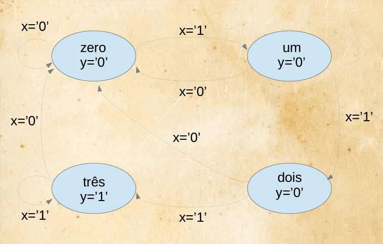

# Máquinas de estado

É um método de projeto de sistemas em que:
- As operações possam ser descritas por meio de uma lista bem definida de estados
- A lista dos estados seja preferivelmente não tão longa
- As condições necessárias para se ir de um estado para outro seham relacionadas
- E a saída desejada em cada estado também seja definida

## Código genérico de uma máquina de estados

```vhdl
library ieee;
use ieee.std_logic_1164.all;

entity <entity_name> is
port (
    input: in <data_type>;
    clock, reset: in std_logic;
    output: out <data_type>;
);
end entity;

architecture <arch_name> of <entity_name> is
    type state is (A, B, C, ...);
    atribute enum_encoding of state: type is "sequential"; -- opcional
    signal pr_state, nx_state: state;
begin
    process(reset, clock)
    begin
        if(reset = '1') then
            pr_state <= A;
        elseif (clock'EVENT and clock = '1') then
            pr_state <= nx_state;
        end if;
    end process;

    process(input, pr_state)
    begin
        case pr_state is
            when A => y = <out_value>
                if (input = <value>) then
                    output <= <value>;
                    nx_state <= B;
                else ...
            when B => y = <out_value>
                if (input = <value>) then
                    output <= <value>;
                    nx_state <= C;
                else ...
            when...
        end case;
    end process;

    process (clock)
    begin
        if(clock'EVENT and clock = '1') then
            new_output <= old_output;
        end if;
    end process;
end <arch_name>;
```

Ex: Detector de "111"



```vhdl
library ieee;
use ieee.std_logic_1164.all;

entity dell111 is
port (
    clk, rst: in std_logic;
    x: in std_logic;
    y: out std_logic;
);
end entity;

architecture arq of det111 is
    type states is (A, B, C, D);
    signal pr_state, nx_state: states;
begin
    process(rst, clk)
    begin
        if(rst = '0') then
            pr_state <= A;
        elseif (clk'EVENT and clk = '1') then
            pr_state <= nx_state;
        end if;
    end process;

    process(x, pr_state)
    begin
        case pr_state is
            when A => 
                y = '0';
                if (x = '1') then
                    nx_state <= B;
                else 
                    nx_state <= A;
                end if;
            when B => 
                y = '0';
                if (x = '1') then
                    nx_state <= C;
                else 
                    nx_state <= A;
                end if;
            when C => 
                y = '0';
                if (x = '1') then
                    nx_state <= D;
                else 
                    nx_state <= A;
                end if;
            when D => 
                y = '1';
                if (x = '1') then
                    nx_state <= D;
                else 
                    nx_state <= A;
                end if;
        end case;
    end process;
end architecture;
```